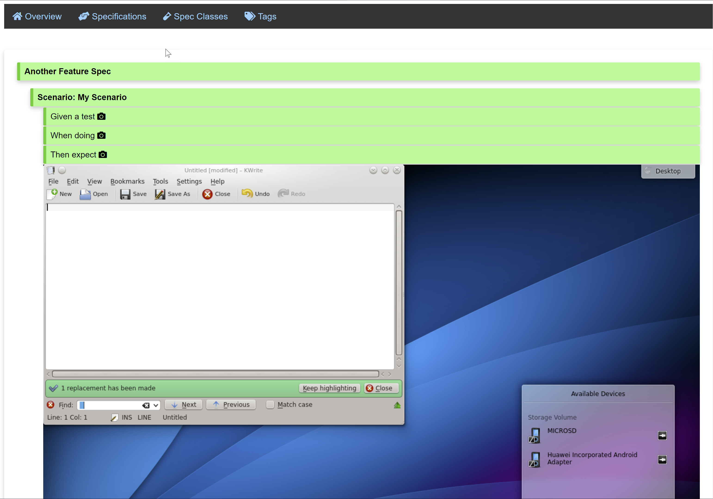

# Arete-Gradle-Plugin

[](https://search.maven.org/search?q=g:%22com.github.mictaege%22%20AND%20a:%22arete-gradle%22)
[](https://search.maven.org/search?q=g:org.junit.jupiter%20AND%20v:5.9.1)
[](http://www.apache.org/licenses/LICENSE-2.0.html)

Gradle reporting plugin for the [Arete](https://github.com/mictaege/arete) JUnit5 testing framework.



## Usage

Add the `arete-gradle` plugin to your `build.gradle` file using the `buildscript` section.

```Groovy
buildscript {
    repositories {
        mavenCentral()
    }
    dependencies {
        classpath group: 'com.github.mictaege', name: 'arete-gradle', version:'20xxx.x.x'
    }
}

plugins {
    id 'java'
    id 'com.github.mictaege.arete' version '2022.2'
}
```

## Reports

The reports generated for the `arete` specifications will be written to the `<your_project>/build/reports/arete/<task>/index.html` folder.
This is a parallel structure to the gradle test reporting structure `<your_project>/build/reports/test/<task>/index.html`.


## Screenshot-Taking

```Java
@Spec class WebshopSpec {

    private WebDriver webDriver;
    
    @RegisterExtension
    public ScreenshotExtension screenshots 
            = new ScreenshotExtension(new MySeleniumScreenshotTaker(webDriver));
    
    //...

}
```

```Java
public class MySeleniumScreenshotTaker implements ScreenshotTaker {

    private WebDriver webDriver;
    
    public MySeleniumScreenshotTaker(WebDriver webDriver) {
        this.webDriver = webDriver;
    }
    
    @Override
    public Set<TestResult> takeWhen() {
        return Stream.of(SUCCESS, FAILURE).collect(toSet());
    }

    @Override
    public byte[] getImageBytes() {
        //Read PNG image bytes from web driver
    }

}
```


