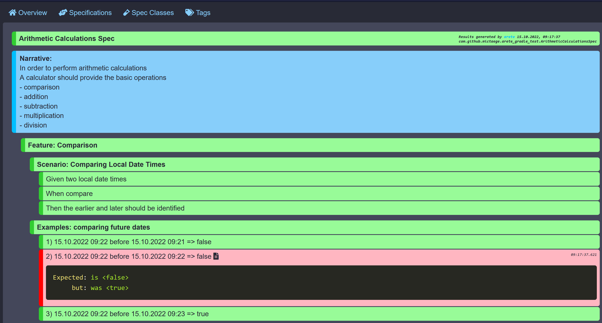

# Arete-Gradle-Plugin

[](https://plugins.gradle.org/plugin/io.github.mictaege.arete)
[](https://search.maven.org/search?q=g:%22io.github.mictaege%22%20AND%20a:%22arete-gradle%22)
[](https://central.sonatype.com/artifact/org.junit.jupiter/junit-jupiter/5.10.2)
[](http://www.apache.org/licenses/LICENSE-2.0.html)

Gradle reporting plugin for the [Arete](https://github.com/mictaege/arete) JUnit5 testing framework.



## Usage

Add the `arete-gradle` plugin to your `build.gradle` file.

```Groovy
plugins {
    id 'java'
    id 'io.github.mictaege.arete' version '20xx.x.x'
}
```

## Reports

The reports generated for the `arete` specifications will be written to the `<your_project>/build/reports/arete/<task>/index.html` folder.
This is a parallel structure to the gradle test reporting structure `<your_project>/build/reports/test/<task>/index.html`.


## Screenshot-Taking

```Java
@Spec class WebshopSpec {

    private WebDriver webDriver;
    
    @RegisterExtension
    public ScreenshotExtension screenshots 
            = new ScreenshotExtension(new MySeleniumScreenshotTaker(webDriver));
    
    //...

}
```

```Java
public class MySeleniumScreenshotTaker implements ScreenshotTaker {

    private WebDriver webDriver;
    
    public MySeleniumScreenshotTaker(WebDriver webDriver) {
        this.webDriver = webDriver;
    }
    
    @Override
    public Set<TestResult> takeWhen() {
        return Stream.of(SUCCESS, FAILURE).collect(toSet());
    }

    @Override
    public byte[] getImageBytes() {
        //Read PNG image bytes from web driver
    }

}
```

## Colorschemes

The colorscheme of the reports can be changed by setting the `arete.colorscheme` property in your `build.gradle.kts` file.

Either by using a predefined colorscheme

```Kotlin
arete {
    colorScheme = CatppuccinLatteColors()
}
```

or by providing a custom colorscheme.

```Kotlin
arete {
    colorScheme = object : AreteColorScheme {
        override val arete_color_background = "#000000"
        override val arete_color_card = "#111111"
        override val arete_color_foreground = "#ffffff"
        override val arete_color_ignored = "gray"
        override val arete_color_ignored_emph = "darkgray"
        override val arete_color_successful = "green"
        override val arete_color_successful_emph = "darkgreen"
        override val arete_color_aborted = "orange"
        override val arete_color_aborted_emph = "darkorange"
        override val arete_color_failed = "red"
        override val arete_color_failed_emph = "darkred"
        override val arete_color_neutral = "blue"
        override val arete_color_neutral_emph = "darkblue"
    }
}
```
Currently predefined colorschemes are:
- `AreteClassicColors`
- `CatppuccinMochaColors`
- `CatppuccinMacchiatoColors`
- `CatppuccinFrappeColors`
- `CatppuccinLatteColors`
- `DraculaColors`
- `AlucardColors`
